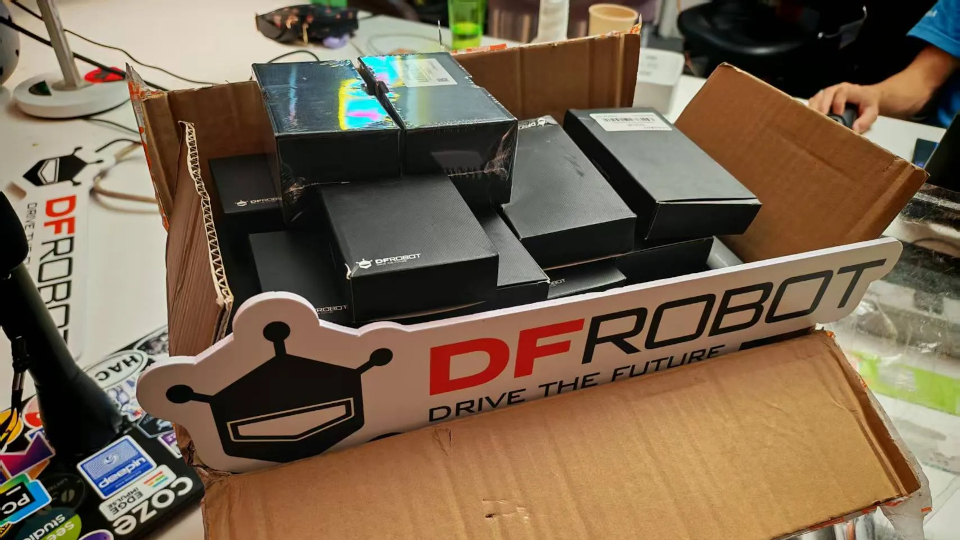
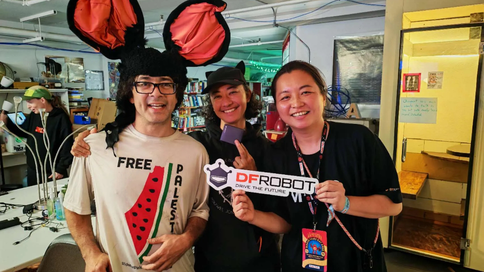
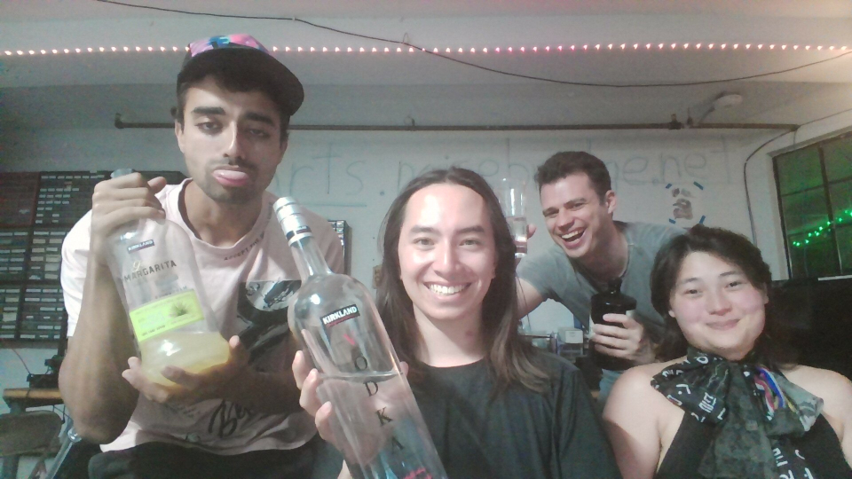

# Firebeetle 2 Board ESP32-C6

A project to control a <a href="https://wiki.dfrobot.com/SKU_DFR1075_FireBeetle_2_Board_ESP32_C6">Firebeetle 2 Board ESP32-C6</a> in Rust.

## History 

On September 28, 2025, [DFRobot](https://www.dfrobot.com/?srsltid=AfmBOoqllNjgG_zJgZkg9oiuPBRGeVRlktwVre_8koLvTOnrOWP0Rfza) came to [Noisebridge](https://www.noisebridge.net/)'s [afterparty](https://luma.com/nbmrk6qb) for [Maker Faire Bay Area](https://bayarea.makerfaire.com/) 2025.

They very generously donated 90 pcs [esp32 C6](https://wiki.dfrobot.com/SKU_DFR1075_FireBeetle_2_Board_ESP32_C6)/ several [esp32 C5](https://wiki.dfrobot.com/SKU_DFR1222_Firebeetle_2_ESP32_C5_Development_Board)/ several [4 Channel USB to Serial Converter (RS485 / RS232 / TTL)](https://www.dfrobot.com/product-2879.html)

<p align="center">
  
</p>

Thank you very much to DFRobot <3

<p align="center">
  
</p>

On September 30, 2025, a few Noisebridgers got together and started to hack on them. [Jet](https://jetpham.com) brought up programming them with [embedded rust](https://docs.rust-embedded.org/book/). This repo is our attempt to work on them together. To commemorate we took this picture:

<p align="center">
  
</p>

> We used Kirkland Vodka to clean flux after soldering header pins

## Setup

This project requires Nix for development. Follow these steps to set up the development environment:

1. Install Nix if you haven't already:
   - Follow the installation instructions at [nixos.org](https://nixos.org/download.html)

2. Enter the development environment:
   ```bash
   nix develop
   ```

## Tools and Documentation

- **[The Rust on ESP Book](https://docs.espressif.com/projects/rust/book/preface.html)** - Embedded Rust development guide
- **[FireBeetle 2 Board ESP32-C6 Wiki](https://wiki.dfrobot.com/SKU_DFR1075_FireBeetle_2_Board_ESP32_C6#Pin%20Definition)** - Hardware documentation and pin definitions

## Running

To run the project:

```bash
sudo cargo run --release
```

**Note:** The `sudo` command is required for accessing the USB serial port on most Linux systems.
